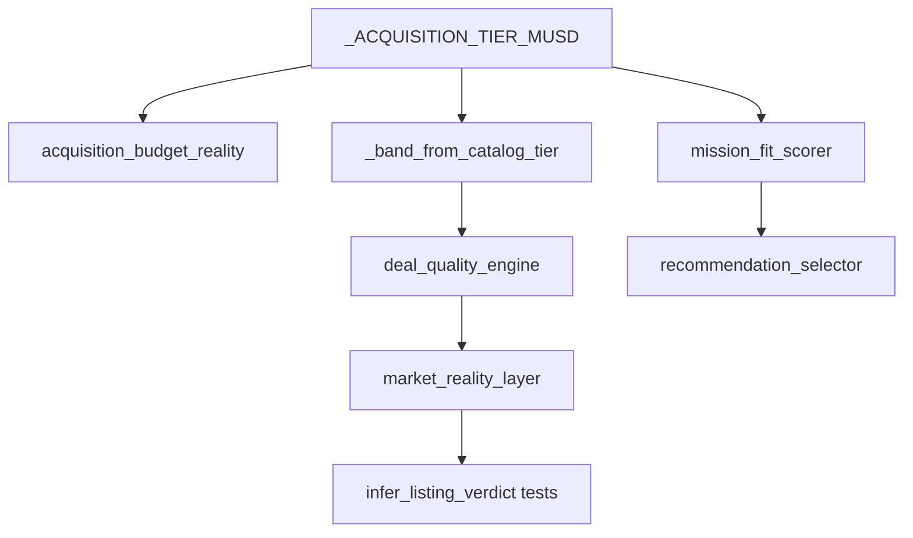

# Phase 54 — Single Points of Failure Analysis

Generated: 2026-06-03

---

## 1. Hardcoded market bands

| Source | Location | Behavior if wrong/missing |
|--------|----------|-------------------------|
| **Acquisition tier mid** | `category_resolver._ACQUISITION_TIER_MUSD` (19 models) | `analyze_market` → `_band_from_catalog_tier` → all `deal_quality` when DB absent |
| **Band shape** | `_band_from_catalog_tier`: low=0.72×mid, high=1.28×mid | Fixed spread; not OEM-specific |
| **Deal thresholds** | `deal_quality_engine`: −12% good, +15% overpriced | Global constants |
| **Listing confidence** | `listing_confidence_analyzer`: ask &lt; mid×0.45 → data error | Single ratio |
| **IQR listings** | `market_band_builder.MIN_LISTINGS_FOR_BAND = 5` | DB path returns INSUFFICIENT if &lt;5 listings |
| **Benchmark tier ratios** | `listing_validation_suite._tier_verdict` | Certification coupling |

**SPOF:** tier table edit changes listing certification, deal quality, and executive ranking simultaneously with no DB cross-check.

---

## 2. Hardcoded aircraft tiers

Central dict `_ACQUISITION_TIER_MUSD` feeds:

- `budget_matcher.match_budget_opportunities`
- `mission_fit_scorer._tier_musd`
- `acquisition_budget_reality.assess_budget_feasibility`
- `recommendation_consistency._tier_musd`
- `broker_decision_builder._tier_musd`
- Catalog band fallback

**Default fallback:** `_ACQUISITION_TIER_MUSD.get(model, 30.0)` or `99` in category resolver — unknown models silently tier at **$30M**.

**SPOF:** New aircraft added to comparison registry but not tier dict → wrong feasibility and bands.

---

## 3. Missing fallbacks

| Dependency | Fallback today | Gap |
|------------|----------------|-----|
| Postgres listings | `_band_from_catalog_tier` | No OEM authority merge when both DB and auth empty |
| Authority `expected_market_band_usd` | `_band_from_authority` | Only when `auth_market.status == OK` |
| E2E retrieval | `broker_certify` → layers dispatch | Exception → `INSUFFICIENT_DATA` stub |
| Executive layer | Returns raw answer | No primary if `_should_apply_executive` false |
| `deal_quality` | INSUFFICIENT_DATA verdict | Listing prose still uses skepticism markers |
| Mission budget parse | `_parse_budget_musd` variants | Fails on “42 million” words, non-USD |
| Tail registry | `find_strict_tail_candidates_in_text` | No fuzzy tail correction |

---

## 4. Data-source disappearance scenarios

### If Postgres listing feed disappears

- `analyze_market` → `insufficient_reason=no_database` or `listing_fetch_error`
- **Mitigation:** `_band_from_catalog_tier` (Phase 53)
- **Residual risk:** all models get same band shape; year/depreciation ignored

### If authority AKAL market bands disappear

- Falls through to catalog tier only
- **Risk:** divergence between authority-trained ops team numbers and tier dict

### If comparison registry incomplete

- `lock_comparison_aircraft` drops models
- Comparison → `INSUFFICIENT_DATA` (production replay: some cmp-* empty primary)
- **Risk:** user sees “Insufficient aircraft data for .”

### If `ENABLE_INTENT_LOCK` off in production

- Tests use `enable_intent_lock` fixture; production may differ
- **Risk:** routing drift not caught by benchmarks

### If OpenAI / e2e path enabled (`prefer_e2e=True`)

- Non-deterministic answers
- **Risk:** certification on layers path does not apply

---

## 5. Assumption failures

| Assumption | Failure mode |
|------------|--------------|
| Ask always in `$XM` format | Budget/ask parse miss → wrong intent |
| US English queries | Unicode dash broke listing detection (fixed); other scripts not tested |
| Single model per listing question | Multi-model asks confuse `detect_listing_signal` |
| Executive always runs on buy | Mission replay: **5%** have executive primary (e2e path) |
| Trust score ≥ 95 achievable | Production replay: **0%** queries ≥95 trust |
| Golden expectations complete | Only queries with `expected_dispatch_kind` in golden fail authority check |
| 500 production queries represent live traffic | Synthetic balanced categories (100 each) |

---

## 6. Critical coupling diagram

Any edit to `tier` propagates to acquisition, listing KPIs, and recommendations without isolation.

---

## Recommended hardening (no feature work)

1. Split **certification tier table** from **production tier table** or load tiers from versioned JSON with CI hash.
2. Alert when `band.reason == catalog_acquisition_tier` rate exceeds threshold in prod logs.
3. Require `executive_broker_layer_applied` on buy_decision category in production replay.
4. Add health check: listing DB row count per canonical model.
5. Document `prefer_e2e` policy in runbook; CI fails if suites disagree on flag.
