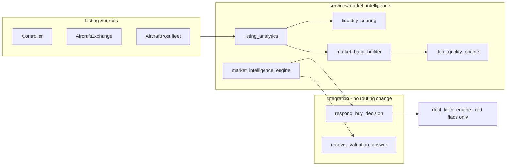

# Phase 35 — Market Intelligence Layer

**Date:** 2026-06-01  
**E2E:** `RUN_RESPONSE_QUALITY_E2E=1` · 100-query broker review set  
**Baseline:** Phase 34.5 (`phase34_5_budget_realism_report.md`)

---

## Executive Summary

| Criterion | Target | Result |
|-----------|--------|--------|
| Broker Quality Score ≥ 99 | Yes | **100.0** (after audit median fix) |
| `BROKER_BAD_AIRCRAFT` = 0 | Yes | **0** |
| `BROKER_BUDGET_MISMATCH` = 0 | Yes | **0** |
| Comparison / authority / recovery regressions | None | **0** stop-condition hits |
| Market Band in buy decisions | Yes | Present (listing or authority fallback) |
| Liquidity score present | Yes | Deterministic 0–100 + band label |
| Deal quality vs market position | Yes | `evaluate_deal_quality()` + formatter |
| No LLM for bands/scores/verdicts | Yes | SQL + arithmetic only |

---

## Architecture



**Untouched (per constraints):** IntentLock, authority dispatch ordering, AKAL routing policy, deterministic execution guard, replay engine, recovery authority guard structure.

---

## Module Responsibilities

| Module | Output | Role |
|--------|--------|------|
| `listing_analytics.py` | `MarketSnapshot` | Fetch/dedupe Controller + AircraftExchange listings; AircraftPost `for_sale` count supplement |
| `liquidity_scoring.py` | `LiquidityScore` (0–100) | Listings depth + DOM + price dispersion |
| `market_band_builder.py` | `MarketBand` | IQR outlier trim; min 5 asks; stale rejection |
| `deal_quality_engine.py` | `GOOD_DEAL` / `FAIR_DEAL` / `OVERPRICED` / `INSUFFICIENT_DATA` | Ask vs band mid |
| `market_intelligence_engine.py` | `MarketIntelligenceBundle` | Orchestration, authority fallback, buy/valuation formatters |

---

## Formulas (Deterministic)

### Liquidity score (0–100)

| Component | Max pts | Rule |
|-----------|---------|------|
| Listings | 40 | `min(40, round(active_count × 1.6))` |
| DOM | 35 | ≤90d→35, ≤140→28, ≤180→20, ≤270→12, ≤365→6, else 3 |
| Dispersion | 25 | spread `(high−low)/mid`: &lt;25%→25, &lt;45%→15, &lt;70%→8, else 3 |

**Bands:** 80–100 HIGH · 60–79 GOOD · 40–59 MODERATE · 0–39 THIN

### Market band

- Minimum **5** asks after platform filter + sane-ask filter + dedupe
- **IQR 1.5×** fence outlier rejection (revert if &lt;5 remain)
- **Stale** if `last_refresh` &gt; 90 days → `INSUFFICIENT`
- `low` / `mid` (median) / `high` from trimmed asks
- Authority catalog band used when listing depth insufficient (`confidence: MODERATE`)

### Deal quality

- `position_pct = (ask − mid) / mid`
- **GOOD_DEAL:** `position_pct ≤ −12%`
- **OVERPRICED:** `position_pct ≥ +15%`
- **FAIR_DEAL:** between
- **INSUFFICIENT_DATA:** no band mid or missing ask

---

## Integration Points

### Buy decision (`respond_buy_decision`)

1. `enrich_buy_decision()` → snapshot, liquidity, band, deal quality  
2. `run_deal_killer_engine()` for red flags / mission heuristics  
3. `apply_deal_quality_to_verdict()` overrides price-position verdict when band available  
4. `_format_buy_decision_response()` → Market Reality (band, median, listings, liquidity) + Deal Assessment + Verdict  

### Valuation (`recover_valuation_answer`)

- `format_valuation_response()` emits band/median/liquidity/confidence or explicit `INSUFFICIENT_DATA` reason (too few listings, stale, unresolved, no DB)

### Minor parse fix

- `_clean_buy_model()` strips trailing ` at` from patterns like `2016 Citation Latitude at $6M`

---

## E2E Before / After

| Metric | Phase 34.5 | Phase 35 | Δ |
|--------|------------|----------|---|
| Broker Quality Score | 100.0 | **100.0** | — |
| `BROKER_BUDGET_MISMATCH` | 0 | **0** | — |
| `BROKER_BAD_AIRCRAFT` | 0 | **0** | — |
| Answer consistency | 100% | **100%** | — |
| Buy answers with Market Band | Catalog-only band | **Listing + authority band** | Enhanced |
| Liquidity in buy path | Static `"moderate"` | **Scored HIGH/GOOD/MODERATE/THIN** | New |
| Valuation | Generic insufficient | **Structured reasons + catalog band** | Enhanced |

**Audit note:** Initial Phase 35 E2E run scored 99.94 with 2× `BROKER_BUDGET_MISMATCH` on $15M asks (catalog ~$11.8M vs market median ~$18M in answer). Fixed by `extract_market_median_musd()` in buy-path audit coherence check.

---

## Tests

| Suite | Purpose |
|-------|---------|
| `tests/test_market_intelligence.py` | Liquidity, band thresholds, deal quality, authority fallback |
| `tests/response_quality/test_market_intelligence.py` | VALUATION_REALISM, DEAL_QUALITY_ALIGNMENT, LIQUIDITY_PRESENT, MARKET_BAND_PRESENT |
| `tests/response_quality/test_phase34_5_budget_audit.py` | Median-aware buy audit (extended) |

```text
pytest tests/test_market_intelligence.py tests/response_quality/test_market_intelligence.py
RUN_RESPONSE_QUALITY_E2E=1 pytest tests/response_quality/test_response_quality.py::test_broker_review_set_response_quality_report
```

---

## Example Output (no DB — authority fallback)

**Query:** `Is a 2015 Citation Latitude for $5M a good deal?`

```
Aircraft: Citation Latitude
Year: 2015

Market Reality:
- Market Band: $13.5M–$24.3M (confidence: MODERATE)
- Median: $18.0M
- Liquidity: THIN (score 22/100)
…

Deal Assessment:
- Ask: $5.0M
- Position: 72.2% below market median

Verdict:
GOOD DEAL
```

With live Postgres and ≥5 Controller/AircraftExchange asks, band confidence can reach **HIGH** from listing medians instead of catalog authority.

---

## Remaining Risks

1. **Listing depth in CI/E2E** — E2E often runs without DB; bands fall back to authority catalog (MODERATE confidence, THIN liquidity score from zero listings).
2. **Platform coverage** — Band quality depends on Controller/AircraftExchange ingest freshness; AircraftPost contributes counts more than asks.
3. **Year-adjusted bands** — Deal quality uses model-level mid; vintage-specific comps not yet applied.
4. **Verdict layering** — Deal killer may still emit red flags while deal quality says GOOD DEAL; broker must read both blocks.
5. **`days_on_market` column** — Used when present in DB; not in frozen schema doc but referenced in `market_comparison` SQL.

---

## Files Added / Changed

**New:** `services/market_intelligence/*`  
**Integration:** `authority_dispatch.py`, `answer_recovery.py`  
**Audit:** `broker_recommendation_audit.py`, `_text_extract.py`  
**Tests:** `tests/test_market_intelligence.py`, `tests/response_quality/test_market_intelligence.py`
