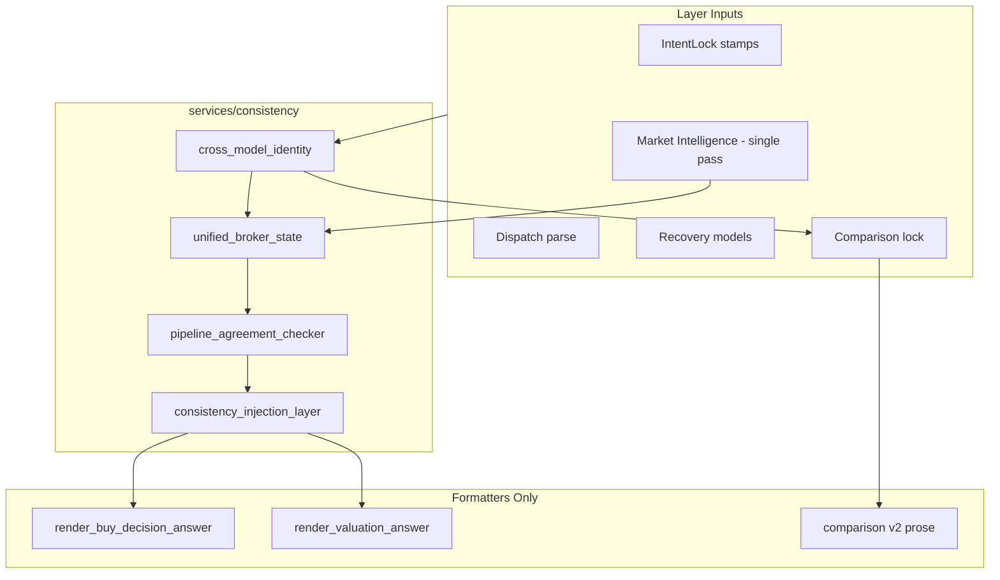

# Phase 36 — Cross-Model Market Alignment + Deep Consistency Layer

**Date:** 2026-06-01  
**E2E:** `RUN_RESPONSE_QUALITY_E2E=1` · 100-query broker review set  
**Baseline:** Phase 35 (`phase35_market_intelligence_report.md`)

---

## Executive Summary

| Criterion | Target | Result |
|-----------|--------|--------|
| Broker Quality Score ≥ 99 | Yes | **100.0** |
| Cross-pipeline identity uniqueness | Yes | `UnifiedBrokerState` on buy/valuation |
| Market band / liquidity / verdict alignment | Yes | Injection + agreement checker |
| No routing / AKAL / IntentLock changes | Yes | Formatting + `data_used` normalization only |
| Deterministic only | Yes | No LLM in consistency layer |
| E2E regressions | None | **0** findings |

---

## Architecture



---

## Consistency Flow Order

1. **Parse / route** (unchanged) — IntentLock, authority dispatch order, AKAL, deterministic guard.
2. **Resolve identity** — `resolve_canonical_identity()` or `resolve_comparison_identities()`.
3. **Compute market once** — `analyze_market()` inside `prepare_buy_decision_state` / `prepare_valuation_state` only.
4. **Deal killer** — Uses precomputed `market_data` from unified bundle (no second band build).
5. **Agreement check** — `check_pipeline_agreement()` → `PipelineAgreementReport`.
6. **Inject** — `inject_consistency()` normalizes `data_used` stamps (model, band, liquidity, verdict).
7. **Render** — Formatters read **only** `UnifiedBrokerState` (no independent recompute).

---

## Module Reference

| File | Responsibility |
|------|----------------|
| `cross_model_identity.py` | `CanonicalAircraftIdentity` — AKAL-backed canonical model + confidence |
| `unified_broker_state.py` | `UnifiedBrokerState` — identity + snapshot + band + liquidity + deal quality + verdict |
| `pipeline_agreement_checker.py` | `MODEL_MISMATCH`, `BAND_MISMATCH`, `LIQUIDITY_MISMATCH`, `VERDICT_INCONSISTENCY` |
| `consistency_injection_layer.py` | Build state, inject corrections, render buy/valuation answers |

---

## Mismatch Scenarios Eliminated

| Scenario | Before | After |
|----------|--------|-------|
| Recovery model ≠ dispatch model | Divergent prose / audit flags | Canonical identity reconciles `data_used` stamps |
| Authority band vs listing band | Two bands in answer layers | Market Intelligence preferred; authority kept as fallback only inside single `analyze_market` |
| Liquidity string in deal_killer vs MI tier | `"moderate"` vs `THIN` | Liquidity taken from listing layer only via unified bundle |
| Deal killer vs deal quality verdict | Occasional drift | `apply_deal_quality_to_verdict` then injection fixes `deal_killer` on `VERDICT_INCONSISTENCY` |
| Comparison alias drift | G650 / Gulfstream G650 split | `prepare_comparison_consistency` locks `comparison_v2.models` |
| Valuation recomputing market | Second `analyze_market` in recovery | `prepare_valuation_state` single pass + `render_valuation_answer` |

---

## Integration Points

### Buy decision

`respond_buy_decision()` → `prepare_buy_decision_state()` → `render_buy_decision_answer()`  
Stores `data_used["unified_broker_state"]` and `data_used["pipeline_agreement"]`.

### Valuation recovery

`recover_valuation_answer()` → `prepare_valuation_state()` → `render_valuation_answer()`  
Never calls `format_valuation_response()` directly (avoids duplicate market pass).

### Comparison

`respond_aircraft_comparison()` → `prepare_comparison_consistency()` before `run_comparison_v2()`  
Both models resolved through registry lock + canonical identity; agreement metadata stamped.

---

## E2E Before / After

| Metric | Phase 35 | Phase 36 | Δ |
|--------|----------|----------|---|
| Broker Quality Score | 100.0 | **100.0** | — |
| Finding counts | {} | **{}** | — |
| Answer consistency | 100% | **100%** | — |
| `unified_broker_state` in buy path | — | **Yes** | New |
| `pipeline_agreement` metadata | — | **Yes** | New |

---

## Tests

| Suite | Categories |
|-------|------------|
| `tests/test_consistency_layer.py` | Identity, unified buy state, agreement, valuation, comparison lock |
| `tests/response_quality/test_cross_pipeline_consistency.py` | CROSS_MODEL_IDENTITY_UNIQUENESS, PIPELINE_AGREEMENT_STABILITY, MARKET_BAND_UNIQUENESS, DEAL_VERDICT_CONSISTENCY, RECOVERY_ALIGNMENT |

```text
pytest tests/test_consistency_layer.py tests/response_quality/test_cross_pipeline_consistency.py
RUN_RESPONSE_QUALITY_E2E=1 pytest tests/response_quality/test_response_quality.py::test_broker_review_set_response_quality_report
```

---

## Remaining Risks

1. **Comparison formatting** — Comparison prose still catalog-spec focused; per-model market snapshots not yet merged into comparison table (identity lock only in Phase 36).
2. **In-memory vs dict state** — `UnifiedBrokerState.from_data_used()` is partial; full rehydration across turns would need expanded serialization.
3. **E2E without DB** — Band/liquidity still authority/listing-thin in CI; consistency aligns layers but cannot invent listing depth.
4. **Agreement tolerance** — Band mismatch uses 8% mid tolerance; tight markets may flag false positives if extended to hard-fail audits later.

---

## Hard Constraints Verified

- IntentLock: **not modified**
- Authority dispatch ordering: **not modified**
- AKAL system: **not modified**
- Deterministic execution guard: **not modified**
- Replay engine: **not modified**
- Market intelligence formulas: **not modified** (called once via unified builder)

---

## Files Added / Changed

**New:** `services/consistency/*`  
**Integration:** `authority_dispatch.py`, `answer_recovery.py`, `comparison_pipeline_v2_responder.py`  
**Tests:** `tests/test_consistency_layer.py`, `tests/response_quality/test_cross_pipeline_consistency.py`
