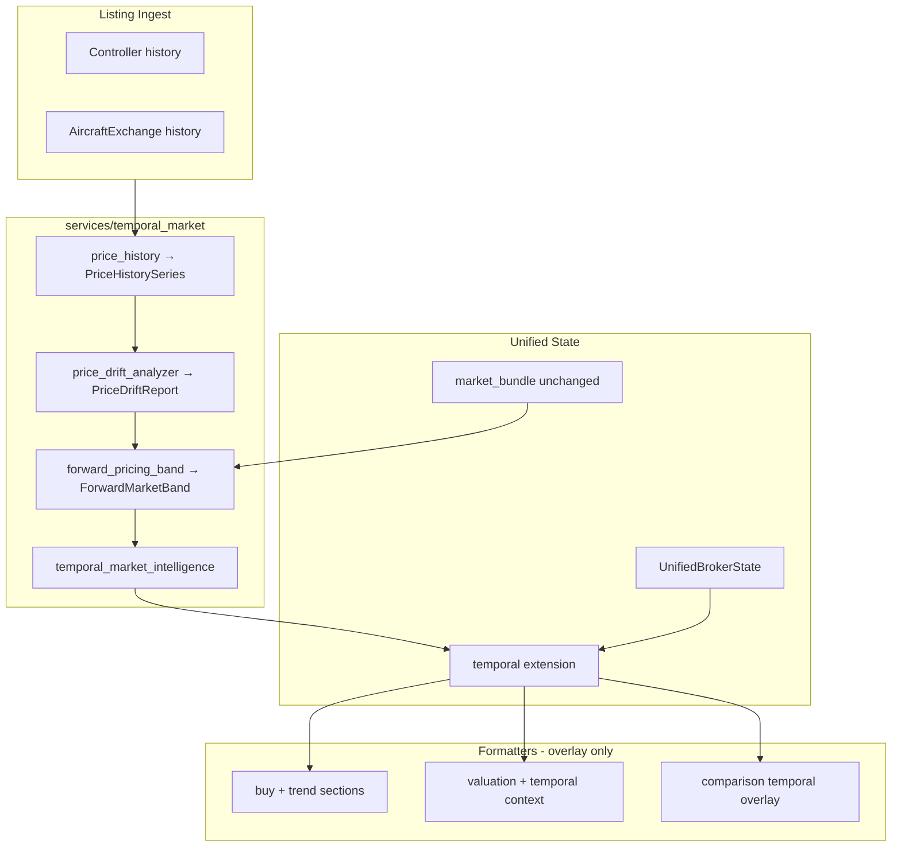

# Phase 37 — Temporal Market Drift + Forward Pricing Layer

**Date:** 2026-06-01  
**E2E:** `RUN_RESPONSE_QUALITY_E2E=1` · 100-query broker review set  
**Baseline:** Phase 36 (`phase36_cross_model_consistency_report.md`)

---

## Executive Summary

| Criterion | Target | Result |
|-----------|--------|--------|
| Broker Quality Score ≥ 99 | Yes | **100.0** |
| Deterministic drift (same input → same output) | Yes | OLS + window % only |
| Core market band / deal quality unchanged | Yes | Overlay only |
| Verdicts not overridden | Yes | Augmentation after Verdict block |
| `UnifiedBrokerState.temporal` additive | Yes | Extended, not rewritten |
| No LLM forecasting | Yes | SQL history + arithmetic |

---

## Drift Pipeline Diagram



---

## Forward Band Math

Given current band \((L, M, H)\) and 90d drift \(d\%\):

1. **Clamp shift:** `shift = clamp(d/100, ±max_shift)` where `max_shift = 12% × (1 − volatility/100)` (floor 2%).
2. **Direction:**
   - UP → positive shift; widen high more than low.
   - DOWN → negative shift; compress band downward.
   - FLAT → mirror current band.
3. **Forward mid:** \(M_f = M × (1 + shift)\); low/high scaled asymmetrically by trend.
4. **Confidence:** HIGH if ≥12 history points and volatility &lt;40; LOW if volatility &gt;65 or &lt;5 points (mirrors current).

---

## Cycle Classification Logic

| Condition | DealTimingSignal |
|-----------|------------------|
| UP trend + thin liquidity (score &lt;60 or THIN/MODERATE thin) | **EARLY_CYCLE** |
| DOWN trend + high liquidity (HIGH/GOOD or score ≥60) | **LATE_CYCLE** |
| FLAT trend | **MID_CYCLE** |
| Other combinations | **MID_CYCLE** |
| &lt;5 history points | **UNKNOWN** |

Does **not** change `GOOD DEAL` / `FAIR DEAL` / `OVERPRICED` verdict from Phase 35.

---

## Comparison Overlay Behavior

After standard comparison prose:

- Per-model: trend direction, 90d drift %, volatility index
- Relative volatility leader if spread &gt;15 index points
- Forward band mid divergence when both models have history

Verdict logic in `comparison_pipeline_v2` is **unchanged**.

---

## Module Reference

| File | Output |
|------|--------|
| `price_history.py` | `PriceHistorySeries` — daily median asks from listings |
| `price_drift_analyzer.py` | `PriceDriftReport` — 30d/90d/1y %, trend, volatility 0–100 |
| `forward_pricing_band.py` | `ForwardMarketBand` |
| `temporal_market_intelligence.py` | `TemporalMarketExtension`, formatters, deal timing |

---

## Integration

| Path | Change |
|------|--------|
| `prepare_buy_decision_state` | `_attach_temporal()` after market bundle |
| `prepare_valuation_state` | `_attach_temporal()` |
| `render_buy_decision_answer` | Appends Market Trend + Deal Timing Signal |
| `render_valuation_answer` | Appends Temporal Context / TEMPORAL_CONFIDENCE_LOW |
| `respond_aircraft_comparison` | Optional temporal overlay appended |
| `UnifiedBrokerState.temporal` | Serialized under `data_used.unified_broker_state.temporal` |

---

## E2E Stability

| Metric | Phase 36 | Phase 37 |
|--------|----------|----------|
| Broker Quality Score | 100.0 | **100.0** |
| Finding counts | {} | **{}** |
| Answer consistency | 100% | **100%** |

---

## Failure Modes

| Mode | Behavior |
|------|----------|
| &lt;5 historical price points | `TEMPORAL_CONFIDENCE_LOW`; forward band mirrors current |
| No Postgres in E2E | Empty history → overlay states insufficient history |
| Thin listings | Drift UNKNOWN / LOW forward confidence |
| High volatility | Shift clamped; forward confidence LOW |

---

## Tests

```text
pytest tests/test_temporal_market_intelligence.py
pytest tests/test_consistency_layer.py tests/response_quality/test_cross_pipeline_consistency.py
```

Categories covered:

- DRIFT_DIRECTION_STABILITY
- FORWARD_BAND_CONSISTENCY
- VOLATILITY_DETERMINISM
- DEAL_TIMING_SIGNAL_CORRECTNESS
- TEMPORAL_EXTENSION_PRESENT_IN_STATE

---

## Hard Constraints Verified

- IntentLock, dispatch ordering, AKAL, deterministic guard, replay: **unchanged**
- Market intelligence liquidity/band/deal formulas: **unchanged**
- `UnifiedBrokerState` core fields: **unchanged** (`.temporal` added only)
