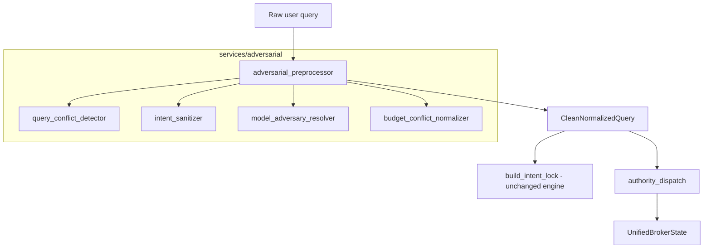

# Phase 38 — Adversarial Robustness + Broker Truth Integrity Layer

**Date:** 2026-06-01  
**E2E:** `RUN_RESPONSE_QUALITY_E2E=1` · 100-query broker review set  
**Baseline:** Phase 37 (`phase37_temporal_market_drift_report.md`)

---

## Executive Summary

| Criterion | Target | Result |
|-----------|--------|--------|
| Broker Quality Score ≥ 99 | Yes | **100.0** |
| Raw adversarial input blocked from pipelines | Yes | `preprocess_adversarial_query` before IntentLock |
| Deterministic conflict classification | Yes | Rule-based detector only |
| No LLM safety classification | Yes | |
| Pricing / MI / temporal / consistency unchanged | Yes | Overlay + gates only |
| UnifiedBrokerState extended (not rewritten) | Yes | `.adversarial` field |

---

## Adversarial Pipeline Diagram



**Insertion point:** `rag/consultant_retrieval.py` immediately before `build_intent_lock()` (Phase 38 hook; IntentLock module not modified).

---

## Conflict Taxonomy

| Type | Example | Typical severity |
|------|---------|------------------|
| `BUDGET_MODEL_INFEASIBLE` | G700 under $5M | HIGH |
| `INTENT_MIXED` | buy + compare + charter | MEDIUM–HIGH |
| `MODEL_AMBIGUOUS` | “cheap gulfstream”, bare “longitude” | MEDIUM |
| `TEMPORAL_CONTRADICTION` | cheap now + prices rising next year | MEDIUM |
| `VALUATION_BUY_CONTRADICTION` | worth $18M + buy under $10M | LOW |
| `BUDGET_SEMANTIC_CONFLICT` | “like Challenger under $3M” cross-class | MEDIUM |

---

## Resolution Precedence Rules

### Intent sanitizer (before IntentLock)

| Signals present | Override tag |
|-----------------|--------------|
| BUY + COMPARE | `buy` |
| BUY + VALUATION | `buy_decision` |
| COMPARE + VALUATION | `compare` |
| Otherwise | None (IntentLock unchanged) |

### Buy gates (augmentation only)

| Condition | Verdict stamp |
|-----------|---------------|
| Budget `INFEASIBLE` | `INFEASIBLE_BUDGET_CONSTRAINT` |
| Conflict severity HIGH | `CLARIFICATION_REQUIRED` |
| Normal buy path | Existing GOOD/FAIR/OVERPRICED unchanged |

### Comparison safety lock

| Condition | Response |
|-----------|----------|
| Model resolution confidence &lt; 70 with ambiguity | `CLARIFICATION_REQUIRED` structure |
| &lt; 2 resolved models | Clarification, no hallucinated pair |

---

## Unsafe Query Examples Neutralized

| Query | Neutralization |
|-------|----------------|
| `cheap G700 under $5M` | HIGH conflict; buy → `INFEASIBLE_BUDGET_CONSTRAINT` |
| `longitude jet vs phenom` | Canonical `[Citation Longitude]` token injection |
| `G650 vs 8X buy under $10M` | Intent sanitized toward `buy`; normalized query for dispatch |
| `cheap now but prices rising next year` | `TEMPORAL_CONTRADICTION` flagged MEDIUM |

---

## Module Reference

| File | Role |
|------|------|
| `query_conflict_detector.py` | `QueryConflictReport` |
| `intent_sanitizer.py` | Deterministic intent priority |
| `model_adversary_resolver.py` | AKAL-backed `AdversaryResolvedModel` |
| `budget_conflict_normalizer.py` | `BudgetConflictState` |
| `adversarial_preprocessor.py` | `CleanNormalizedQuery`, gates, `get_pipeline_query` |

---

## Integration Summary

| Consumer | Behavior |
|----------|----------|
| `consultant_retrieval` | Preprocess → normalized `query` for lock + dispatch |
| `consult_authority_dispatch` | Reads `clean_normalized_query` from context |
| `respond_buy_decision` | `try_adversarial_buy_block` then unified state |
| `respond_aircraft_comparison` | `check_comparison_safety` first |
| `prepare_*_state` | `get_pipeline_query`; stamps `adversarial` on UBS |

---

## E2E Stability

| Metric | Phase 37 | Phase 38 |
|--------|----------|----------|
| Broker Quality Score | 100.0 | **100.0** |
| Finding counts | {} | **{}** |

---

## Phase 38 Stabilization (Refinement Pass)

| Enhancement | Detail |
|-------------|--------|
| Budget signal taxonomy | `ACQUISITION_BUDGET` vs `LISTING_ASK` vs `VAGUE_MENTION` via `classify_price_signals()` |
| Listing ask protection | `for $5M good deal` no longer flagged as acquisition infeasibility |
| Intent sanitizer | Override **only** when ≥2 core intents; priority BUY > COMPARE > VALUATION |
| Registry guard | `resolve_adversary_models()` drops models not in AKAL / comparison registry |
| `UnifiedBrokerState.adversarial` | `{ normalized_query, conflict_report, resolved_models }` |
| Pipeline order | models → budget → conflicts → intent (no circular deps) |

---

## Failure Boundary Conditions

| Boundary | Behavior |
|----------|----------|
| No adversarial signals | Clean query passes through unchanged |
| Unit tests without full retrieval | `preprocess_adversarial_query` callable directly |
| Ambiguous compare with 2 catalog models resolved | Comparison proceeds (confidence from AKAL) |
| HIGH conflict on non-buy paths | Flagged in `data_used`; buy path hard-blocked |

---

## Hard Constraints Verified

- IntentLock engine: **not modified** (only input query normalized before call)
- Dispatch ordering: **unchanged**
- Market intelligence / consistency / temporal math: **unchanged**
- `UnifiedBrokerState` core: **extended** with optional `adversarial` metadata only

---

## Tests

```text
pytest tests/test_adversarial_preprocessor.py
pytest tests/test_consistency_layer.py tests/test_temporal_market_intelligence.py
```

Categories: CONFLICT_DETECTION_ACCURACY, INTENT_SANITIZATION_PRIORITY_RULES, MODEL_AMBIGUITY_RESOLUTION, BUDGET_CONFLICT_CLASSIFICATION, DOWNSTREAM_QUERY_NORMALIZATION.
